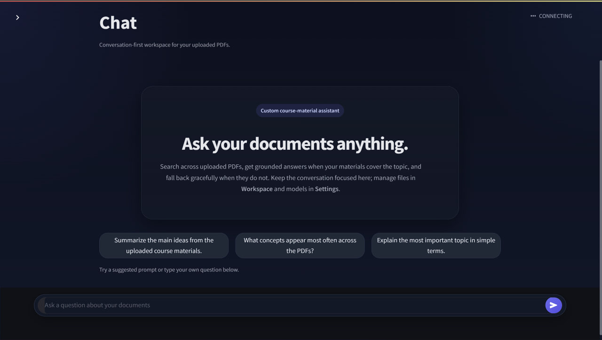
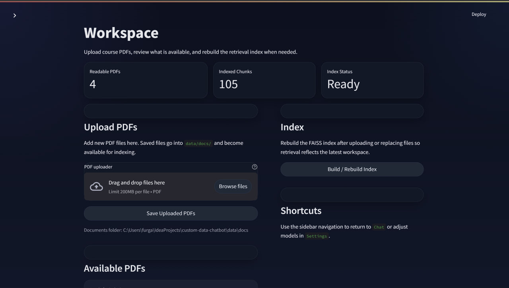
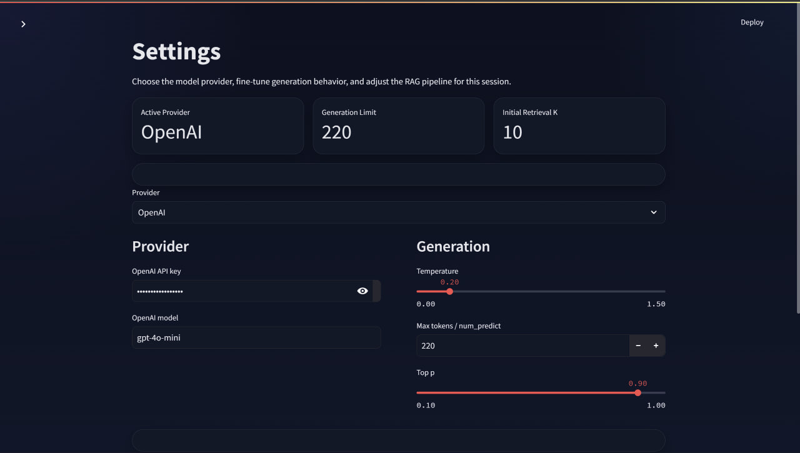

# Custom Data Chatbot

Custom Data Chatbot is a Streamlit-based RAG application for chatting with uploaded PDF course materials. It supports:

- PDF upload and indexing
- semantic chunking and FAISS retrieval
- document-grounded answers
- general-knowledge fallback when retrieval is weak
- short-term chat memory
- separate `Chat`, `Workspace`, and `Settings` pages

The repository is structured to run locally and deploy on Streamlit Community Cloud.

##Streamlit App Link -------
https://furgan0101-chatbot-appstreamlit-app-wj0wva.streamlit.app/

## Project Structure

```text
custom-data-chatbot/
├── app/
│   ├── pages/
│   │   ├── 1_Workspace.py
│   │   └── 2_Settings.py
│   ├── streamlit_app.py
│   └── ui_shared.py
├── data/
│   └── docs/
├── src/
│   ├── chatbot.py
│   ├── chunking.py
│   ├── embed.py
│   ├── ingest.py
│   ├── rerank.py
│   ├── retrieve.py
│   ├── settings.py
│   └── utils.py
├── tests/
├── .streamlit/
│   └── secrets.toml
├── requirements.txt
├── .gitignore
└── README.md
```

## Run Locally

1. Create and activate a Python 3.11+ virtual environment.
2. Install dependencies:

```bash
pip install -r requirements.txt
```

3. Add your OpenAI API key to `.streamlit/secrets.toml`:

```toml
OPENAI_API_KEY = "your_api_key_here"
```

4. Start the app:

```bash
streamlit run app/streamlit_app.py
```

## Local Configuration

Non-secret runtime defaults can be adjusted in `.env.example` and copied into your shell environment if needed. The OpenAI API key should not be stored in `.env`; the app reads it from `st.secrets["OPENAI_API_KEY"]`.

The Settings page lets you change provider, model, and RAG behavior during the current session.

## Streamlit Community Cloud Deployment

1. Push this repository to GitHub.
2. In Streamlit Community Cloud, create a new app pointing to:
   - repository: this repo
   - main file path: `app/streamlit_app.py`
3. In the Streamlit Cloud app settings, add:

```toml
OPENAI_API_KEY = "your_api_key_here"
```

4. Deploy.

## Deployment Notes

- The recommended cloud provider mode is `OpenAI`.
- `Ollama` requires a local Ollama service and is not available on Streamlit Community Cloud.
- Uploaded PDFs are stored inside the app workspace at runtime. Re-deploys or container resets may clear runtime-generated files unless they are re-uploaded.
- `sentence-transformers` downloads model weights on first use, so the first indexing run may be slower.

## Testing

```bash
python -m unittest tests.test_hybrid_chatbot
```

## Secrets

The app reads the OpenAI key through Streamlit secrets:

```python
st.secrets["OPENAI_API_KEY"]
```

## Demo





